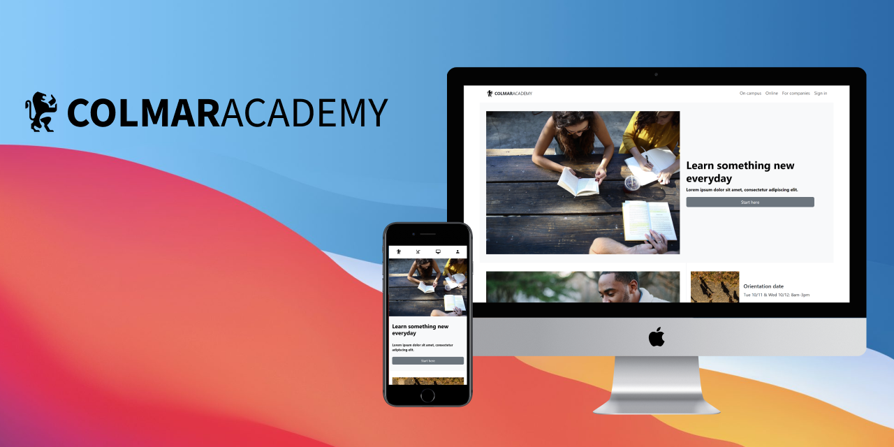

<header>

<!-- shield-status -->

 

<!-- banner -->

<h3>Colmar Academy</h3>
 

    
Responsive Landing Page for School.

    

  

<main>

## About this project
Colmar Academy project is capstone project from [Build a Website with HTML, CSS, and Github Pages](https://www.codecademy.com/learn/paths/learn-how-to-build-websites) skill path by [Codecademy](https://www.codecademy.com/). The project is the final exercise to conclude the learning in building a responsive website using HTML5, CSS3 and GitHub pages. In this project, I consider to use Bootstrap (CSS framework) for manage page's layout easier. 

## Project overview

Wireframe

Demo

    

## Languages & tools

<table>
<tr>
<td align="center"><strong>Languages & tools</strong></td>
<td align="center"><strong>Description</strong></td>
</tr>
<tr>
<td></td>
<td>project's wireframe</td>
</tr>

<tr>
<td></td>
<td>for building webpage</td>
</tr>

<tr>
<td></td>
<td>for styling and spacing webpage</td>
</tr>

<tr>
<td></td>
<td>for manage layout and ready to use component</td>
</tr>

<tr>
<td></td>
<td>for version control</td>
</tr>

<tr>
<td><a target="_blank" href="https://docs.github.com/en/pages"></td>
<td>for deploy webpage</a></td>
</tr>

<tr>
<td><a target="_blank" href="https://docs.github.com/en"></td>
<td>for hosting repository</td>
</tr>

</table>

<!-- ## What the project does
- Transform a wireframe document into a website. 
- Use HTML -->

## What I learned from the project
This is my first capstone project. I've learned a lot since starting the project. Such as 
- I learned how to building responsive landing page that refer from wireframe by using HTML5 CSS3 and Bootstrap.
- I learned how to use Bootstrap.
  
  - mananging spacing that come from Bootstrap's class with CSS.
  - using row and column for manage webpage's layout.
  - using ready to use component for styling webpage.
- I learned how to use version control with git command line.
- I learned how to store my repository with GitHub.
- I learned how to use GitHub pages to deploy webpage.

</main>

---

<!-- REACH ME ON -->
<footer>

## 🤝🏼Reach me on

 

</footer>
